## 01: Introduction 

- https://aneagoie.github.io/keiko-corp
- https://github.com/aneagoie/keiko-corp
- https://github.com/aneagoie/robofriends
- https://github.com/aneagoie/robofriends-redux
- https://github.com/aneagoie/code-splitting-exercise
- https://github.com/aneagoie/robofriends-pwa
- https://github.com/aneagoie/udemy-testing-exercise
- https://github.com/aneagoie/robofriends-testing
- https://github.com/aneagoie/robofriends-typescript
- https://github.com/aneagoie/robofriends-typescript-completed
- https://github.com/aneagoie/next-ssr
- https://www.hacksplaining.com/exercises/sql-injection
- https://github.com/aneagoie/security-client-exercise
- https://github.com/aneagoie/security-server-exercise
- 
- https://github.com/aneagoie/python-cheatsheet
- https://github.com/aneagoie/smart-brain

## 02: SSH

ssh command
```
$ ssh {user}@{host}
```

ssh client for windows: PuTTY

linux has by default. if not then go through - https://www.makeuseof.com/tag/beginners-guide-setting-ssh-linux-testing-setup/
```
$ sudo apt-get install openssh-client
$ sudo apt-get install openssh-server
```

### rsync
go to inside the folder - want to copy to remote server - 
```
$ rsync -av . root@167.99.146.57:~/some-folder

```

3 techniques used in SSH -
1. Symmetrical Encryption: single key
2. Asymmetrical Encryption: public & private key (diffie-hellman key exchange)
3. Hashing: 


### RSA (automatic login without password)
(Don't do it for hosting or remote server. Everytime ask for password is good practice. Do it for github or bitbucket graphical interface)

If does not already have then create .ssh folder-
```
$ mkdir ~/.ssh
$ cd ~/.ssh
$ ls
config      id_rsa      id_rsa.pub      key_backup/     known_hosts
$ 
$ ssh-keygen -C "test@gmail.com"
Enter file in which to save the key: /Users/shah/.ssh/id_rsa_digitalocean
$ ls
config      id_rsa_digitalocean     known_hosts
id_rsa      id_rsa_digitalocean.pub
id_rsa.pub  key_backup/
$ pbcopy < ~/.ssh/id_rsa_digitalocean.pub
$ ssh root@121.121.121.121
root@ubuntu:~# mkdir .ssh
root@ubuntu:~# ls -a
root@ubuntu:~# cd .ssh
root@ubuntu:~# ls
authorized_keys     known_hosts     # if this files does not have, create
root@ubuntu:~# nano authorized_keys
# paste the content in the file
root@ubuntu:~# exit
$ 
```
Close the session and open new terminal - 
```
$ ssh root@121.121.121.121
root@121.121.121.121: Permission denied (publickey).
$
$ cd ~/.ssh
$ ls
config      id_rsa_digitalocean     known_hosts
id_rsa      id_rsa_digitalocean.pub
$
$ ssh-add ~/.ssh/id_rsa_digitalocean
$ ssh root@121.121.121.121
```

But in case, public key is deleted form **authorized_keys** from the remote server, can not be log in with ssh.
```
$ ssh root@121.121.121.121
root@121.121.121.121: Permission denied (publickey).
$ ssh-add ~/.ssh/id_rsa_digitalocean
$ ssh root@121.121.121.121
root@121.121.121.121: Permission denied (publickey).
```
Then use graphical interface to add public key in **authorized_keys**. Digital ocean dashboard > profile > settings > security > Add SSH Key.

> Keep in mind that, you cannot use the control panel in Digital Ocean to add keys to already created droplets. You either have to create a new server after you've added the SSH key on the control panel, or add it manually to the authorized_keys 

Recommended **ssh-keygen** command:
```
$ ssh-keygen -t rsa -b 4096 -C "your_email@example.com"
```

Remove and add identity in ssh - 
```
$ ssh-add -l        # list of all identity
$ ssh-add -D        # remove
$ ssh-add -l        # list of all identity
$ ssh-add ~/.ssh/id_rsa_digitalocean
$
$ ssh-add -l        # list of all identity
```

Tunneling with ssh
```
$ ssh -tt pi@10.2.1.12 ssh -tt pi@10.2.1.13 .......
```

### reference:
- https://www.ostechnix.com/how-to-use-pbcopy-and-pbpaste-commands-on-linux/
- https://help.ubuntu.com/community/AptGet/Howto
- https://www.tecmint.com/rsync-local-remote-file-synchronization-commands/
- https://www.digitalocean.com/community/tutorials/how-to-set-up-apache-virtual-hosts-on-ubuntu-16-04
- https://www.youtube.com/watch?v=NmM9HA2MQGI
- https://www.youtube.com/watch?v=Yjrfm_oRO0w
- https://www.youtube.com/watch?v=vsXMMT2CqqE&t=
- https://www.youtube.com/watch?v=NF1pwjL9-DE
- https://github.com/antonykidis/Setup-ssh-for-github/blob/master/Setup-ssh-on-github.pdf
 
02: class done and practical done

## 03: Performance Part 1

### Keys to performance

1. **Frontend:** critical render path, optimized code, progressive web app
2. **In the wire:** minimize files, minimize delivery
3. **Backend:** CDNs, caching, load balancing, DB Scaling, GZIP 

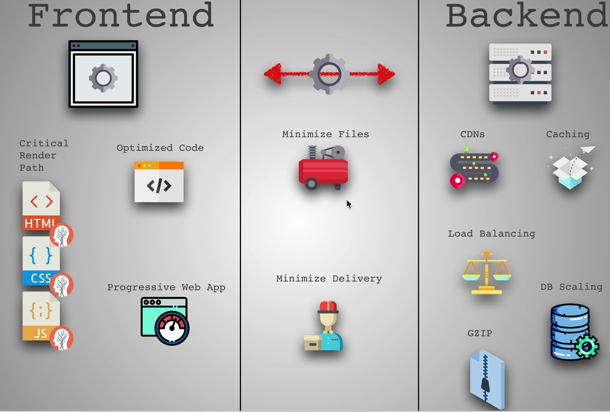

Step - 1
- Minimize Text (use UglifyJS - https://github.com/mishoo/UglifyJS2)
- Minimize Images ()

**JPG:** big pictures or images with many colors
**PNG:** logos with less colors
**GIF:** support transparency
**SVG:** vector graphics with few colors

### Minimize Images
- Transparency: use a PNG
- Animations: use GIF
- Colourful images: use a JPG
- Simple icons, logos, and illustrations: use SVGs
- Reduce PNG with TinyPNG (or, Gimp)
- Reduce JPEG with JPEG-Optimizer (or, Gimp)
- Try to choose simple illustrations over highly detailed photographs
- Always lower JPEG image quality (30-60%)
- Resize image based on size it will be displayed
- Display different sized images for different backgrounds. (use media query)
- Use CDNs like imgix
- Remove image metadata (http://www.verexif.com/en/ or, Gimp)

> To check the fastness of the site with Chrome Dev Tools > Network > Disable cache (check mark), Throttling (drop down),  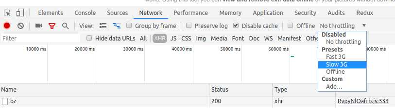

### Network Optimizations
1. Minimize all text
2. Minimize images with Gimp
3. Media Queries
4. Minimize number of files (css, js etc.)

### Rule of thumbs
#### HTML
1. Load ```<style>``` in ```<head>```
2. Load ```<script>``` right before ```</body>```
#### CSS
3. Load only what is needed
4. Above the fold loading
5. Media attributes (media query)
6. Less specificity
#### JS
7. Load scripts asynchronously (if core functionality requires JS, use ```<script async>```. Third party scripts)
8. Defer loading of scripts (if core functionality does not requires JS, use ```<script defer>```. Third party scripts)
9. Minimize DOM manipulation
10. Avoid long running Javascript

https://stackoverflow.com/questions/10808109/script-tag-async-defer


### Test a website's performance
- [PageSpeed Insights](https://developers.google.com/speed/pagespeed/insights/)
- [Test a website's performance](https://www.webpagetest.org/)
- [Pingdom Website Speed Test](https://tools.pingdom.com/)
- [Mobile Site Test](https://www.thinkwithgoogle.com/feature/testmysite)
- [See How Images Affect Your Page Speed](https://pageweight.imgix.com/)
- [Security. Performance. Compatibility. SEO](https://passmarked.com/)


### Exercise: Dev Tools: 
<li><a href="https://developers.google.com/web/tools/chrome-devtools/evaluate-performance/reference#activities" rel="nofollow">View main thread activities in a table</a> to sort activities based on which ones took up the most time.</li><li><a href="https://developers.google.com/web/tools/chrome-devtools/evaluate-performance/reference#fps" rel="nofollow">Analyze frames per second (FPS)</a> to measure whether your animations truly run smoothly.</li><li><a href="https://developers.google.com/web/updates/2017/11/devtools-release-notes#perf-monitor" rel="nofollow">Monitor CPU usage, JS heap size, DOM nodes, layouts per second, and more</a> in real-time with the Performance Monitor.</li><li><a href="https://developers.google.com/web/tools/chrome-devtools/evaluate-performance/reference#screenshots" rel="nofollow">Capture screenshots while recording</a> to play back exactly how the page looked while the page loaded, or an animation fired, and so on.</li><li><a href="https://developers.google.com/web/tools/chrome-devtools/evaluate-performance/reference#interactions" rel="nofollow">View interactions</a> to quickly identify what happened on a page after a user interacted with it.</li><li><a href="https://developers.google.com/web/tools/chrome-devtools/evaluate-performance/reference#scrolling-performance-issues" rel="nofollow">Find scroll performance issues in real-time</a> by highlighting the page whenever a potentially problematic listener fires.</li><li><a href="https://developers.google.com/web/tools/chrome-devtools/evaluate-performance/reference#paint-flashing" rel="nofollow">View paint events in real-time</a> to identify costly paint events that may be harming the performance of your animations.<br><br><a href="https://developers.google.com/web/tools/chrome-devtools/evaluate-performance/reference#main" rel="nofollow">View main thread activity</a> to view every event that occurred on the main thread while you were recording.</li>


### Resource:
- https://99designs.com/blog/tips/image-file-types/
- https://pageweight.imgix.com/
- https://www.sitepoint.com/gif-png-jpg-which-one-to-use/
- http://www.bsidestudios.com/blog/media-queries-common-sizes-cheat-sheet
- https://css-tricks.com/snippets/css/media-queries-for-standard-devices/
- https://stackoverflow.com/questions/985431/max-parallel-http-connections-in-a-browser
- https://developers.google.com/web/fundamentals/performance/optimizing-content-efficiency/loading-third-party-javascript/
- https://developers.google.com/web/tools/lighthouse/
- https://developers.google.com/web/fundamentals/performance/http2/


03: class done and practical done

## 04: React + Redux + Module Bundling

Install [create-react-app](https://www.npmjs.com/package/create-react-app) with npm - 
```
$ sudo npm install -g create-react-app
$ create-react-app robofriends
$ npm start
```

Updating create-react-app in a certain project. Open package.json file and change the version of "react-scripts" in the "dependencies" and then run ```npm install```
```
"dependencies": {
    "react": "^16.2.0",
    "react-dom": "^16.2.0",
    "react-scripts": "2.0.1",
    "tachyons": "^4.9.0"
  },
```

And, run - 
```
$ npm install
$ npm start
$ npm install tachyons
```

Keep only /src/index.css index.js and registerServiceWorker.js and delete the rest.

Create and update /src/components/Card.js

Update /src/index.js

https://robohash.org/

https://robohash.org/any-text?size=200x200

Create and update /src/robots.js

Create and update /src/components/CardList.js

Create and update /src/containers/App.js

Create and update /src/components/SearchBox.js

> **Props** never changes

> **State** may change

Create and update /src/containers/App.css

Create and update /src/components/Scroll.js

```build``` command will build folder inside the project folder

```
$ npm run build
```

Create and update /src/components/ErrorBoundary.js

### React-Redux
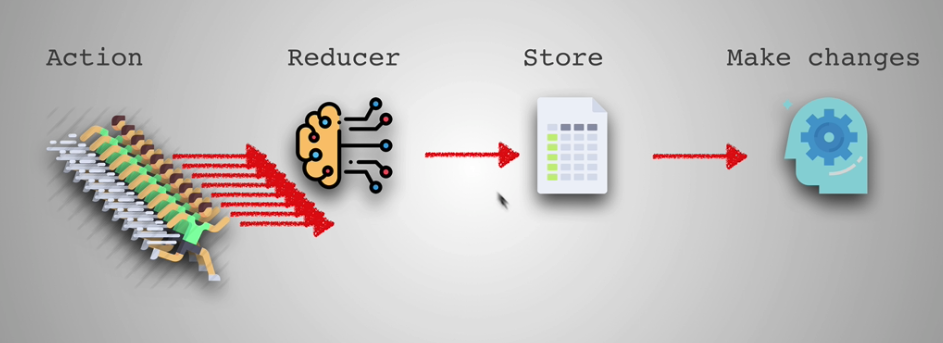

All the ```actions``` come -> one ```reducer``` -> whole app one ```store``` -> ```make changes``` in front end. 

### Flux Pattern

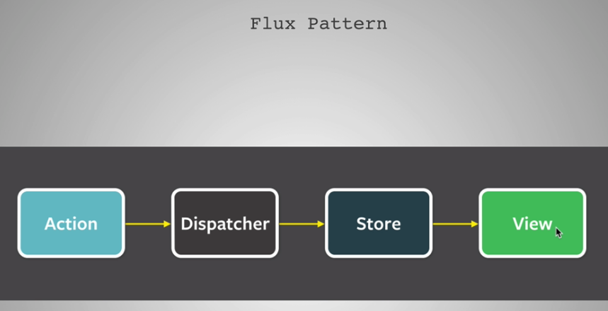

### Middleware

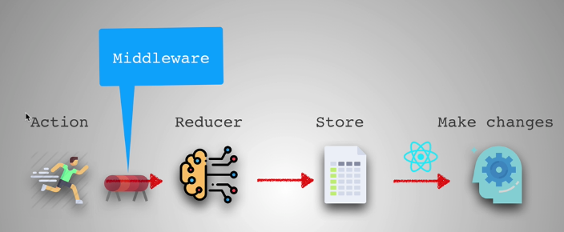

```
$ npm install redux react-redux redux-thunk
```

> ```redux```: is an independent library and can be use with anything

> ```react-redux```: is a connector between **react** and **redux**

> ```redux-thunk```: is a middleware for asynchronous action 

create and update /src/actions.js

create and update /src/constants.js

create and update /src/reducers.js

update /src/index.js

update /src/containers/App.js


> Always think the **pros** and **cons** of using one extra new library. It may have learning curve as well as total performance issue.

### Bundler
- [webpack](https://webpack.js.org/): good for big project
- [parceljs](https://parceljs.org/): good for small project

> Do not use too much time learning bundler. It always changes in new version. Try to read configuration documentation before start. Better concentrate on optimized coding.

### Webpack Configuration
- [Webpack configuration generator](https://createapp.dev/)


```
$ mkdir webpack-project
$ cd webpack-project
$ 
$ npm init -y
$ 
$ code .
$ mkdir dist
$ cd dist
$ touch index.html
$ cd ..
$ 
```

create and update webpack-project/index.html 

```
$ npm install --save-dev webpack webpack-dev-server webpack-cli
```

in package.json
```
{
  "start": "webpack-dev-server --config ./webpack.config.js --mode development"
}
```

```
$ touch webpack.config.js
$ mkdir src
$ touch src/index.js
```

```
module.exports = {
  entry: [
    './src/index.js
  ],
  output: {
    path: __dirname + '/dist', 
    publicPath: '/',
    filename: 'bundle.js'
  },
  devServer: {
    contentBase: './dist'
  },
  module: {
    rules: [{
      test: /\.(js|jsx)$/,
      exclude: /node_modules/,
      use: ['babel-loader']
    }, 
    {
      test: /\.(js|jsx)$/,
      exclude: /node_modules/,
      use: ['eslint-loader']
    }
    ]
  },
  resolve: {
    extensions: ['.js', '.jsx ']
  }
}
```

```
$ npm install --save-dev @babel/core @babel/preset-env @babel/preset-react babel-loader 
$ npm install --save-dev babel-preset-stage-2
$ npm install --save-dev babel-preset-react
$ npm install --save react react-dom
$ npm install --save-dev eslint eslint-loader babel-eslint
```

> babel-preset-stage-2 is deprecated ```npm install --save-dev babel-preset-stage-2```

in package.json
```
},
"babel": {
  "presets": [
    "@babel/preset-env",
    "@babel/preset-react"
  ]
}
,
```

This type of **.eslintrc is deprecated**
```
$ touch .eslintrc

{
  parser: "babel-eslint",
  "rules": {
    "no-console": "error"
  },
  "extends": ["airbnb-base"]
}
```

> **airbnb eslint** is the best in the market https://www.npmjs.com/package/eslint-config-airbnb 
```
$ npm install --save-dev eslint-config-airbnb eslint-plugin-import eslint-plugin-jsx-ally
```

New standard
```
$ touch .eslintrc.json
```

### Parcel

```
$ mkdir parcel
$ cd parcel
$
$ npm init
$ npm install --save react react-dom 
$ npm install --save-dev parcel-bundler babel-preset-env babel
$ touch .babelrc
$ 
```

In .babelrc
```
{
  "presets": ["env", "react"]
}
```

In package.json
```
},
"scripts": {
  "start": "parcel index.html"
},
```

```
$ touch index.html

//---------------------------------------

```

```
$ touch index.js

//---------------------------------------
// index.js in simple react component "Hello World!!!"

$ npm start
```

The 3 principals of redux:
1. Single source of truth
2. State is read only
3. Changes using pure function


04: class done and practical not done

## 05: Performance Part 2

https://github.com/zero-to-mastery/start-here-guidelines

https://github.com/zero-to-mastery

https://zerotomastery.io/

https://github.com/zero-to-mastery/start-here-guidelines/blob/master/Get%20Started.md


> **Code Splitting** makes the app faster. https://reactjs.org/docs/higher-order-components.html
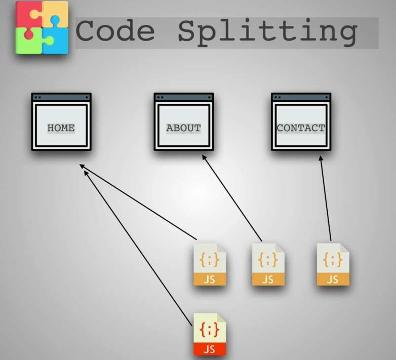

https://reactjs.org/docs/code-splitting.html#reactlazy

https://www.smooth-code.com/open-source/loadable-components/docs/loadable-vs-react-lazy/

https://reactjs.org/docs/code-splitting.html

https://github.com/jamiebuilds/react-loadable

> Append ?react_perf to your local server URL (e.g. localhost:3000/?react_perf) and visit that URL in a browser. Check **Highlight Updates**.
https://chrome.google.com/webstore/detail/react-developer-tools/fmkadmapgofadopljbjfkapdkoienihi?hl=en
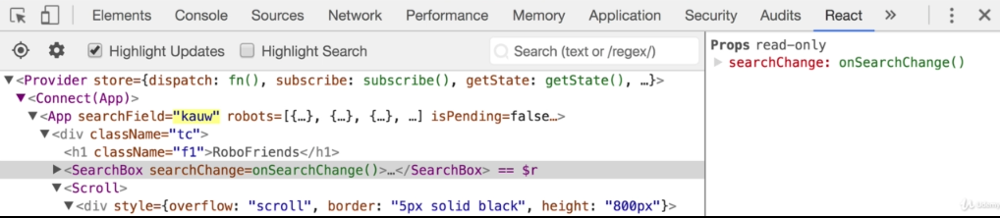

https://medium.com/@wereHamster/beware-react-setstate-is-asynchronous-ce87ef1a9cf3

https://vasanthk.gitbooks.io/react-bits/patterns/19.async-nature-of-setState.html

https://github.com/maicki/why-did-you-update


### Optimizing Code
1. Only loaded what is needed:
  - Code Splitting
  - Tree Shaking
2. Avoid blocking main thread
3. Avoid Memory Leaks
4. Avoid Multiple re-rendering

https://developers.google.com/web/fundamentals/performance/optimizing-javascript/tree-shaking/

### Progressive Web App (PAW)

http://debuggerdotbreak.judahgabriel.com/2018/04/13/i-built-a-pwa-and-published-it-in-3-app-stores-heres-what-i-learned/

https://medium.com/@firt/progressive-web-apps-on-ios-are-here-d00430dee3a7

Some of the top PWAs from around the world: https://appsco.pe/

Publishing (static) webpage using Github Pages: https://pages.github.com/

Progressive Web Apps Checklist: https://developers.google.com/web/progressive-web-apps/checklist

Finally, if you would like to implement HTTPS yourself, use https://letsencrypt.org/docs/

To learn more, have a look at https://developers.google.com/web/tools/lighthouse/audits/has-viewport-meta-tag

generate icons for your (robofriends) PWA App: https://realfavicongenerator.net/

What Web Can Do Today: https://whatwebcando.today/

> Do not add any new technology just because it is a **latest hype** and **cool**. Add new technology if it adds great value in App.

PWA checklist tools for Web Developers(perfect 100 score from Lighthouse on all categories): https://developers.google.com/web/tools/lighthouse/

Example of PWA, https://pokedex.org/, https://hnpwa.com/

CDN https://www.cloudflare.com/

### Common PWA features-
1. HTTPS
2. App Manifest
3. Service Worker

In index.html
```
<meta name="viewport" content="width=device-width, initial-scale=1, shrink-to-fit=no">
```

and ```manifest.json``` **(how the app should appear in mobile device)** are must for PWA.
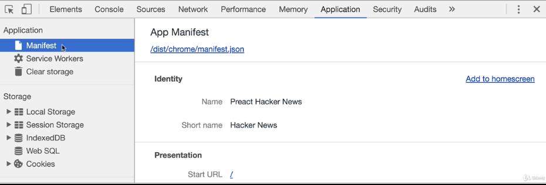

You can see https://github.com/jeffposnick/create-react-pwa/compare/starting-point...pwa to see what you would need to do to add service worker into an existing create react app project without the default service worker.

Extra resources - https://jakearchibald.github.io/isserviceworkerready/ , https://auth0.com/blog/introduction-to-progressive-web-apps-push-notifications-part-3/

ACCESSIBILITY - https://www.w3.org/standards/webdesign/accessibility

You can find the solution Github repository at - https://github.com/aneagoie/robofriends-pwa

Finally, I would like to share with you this resource to finish off this section. It is a website that lists all tools that you can use to improve front end performance of your web app: https://progressivetooling.com/

After build a react app, ```/build/service-worker.js``` contains all service worker code.
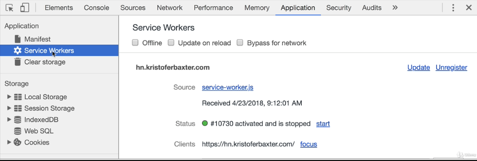 

> How service worker works? 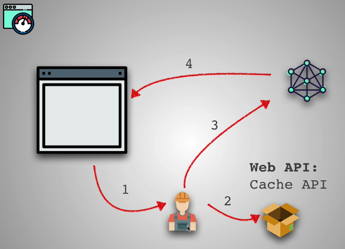

> Where service worker keep cache? 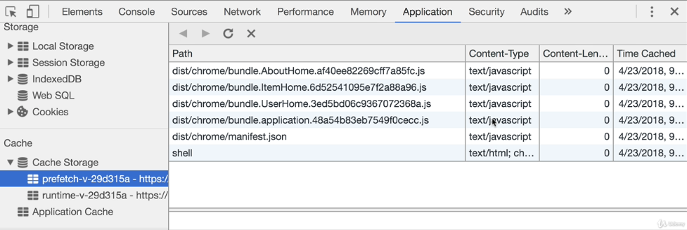

> Need to be careful in case of building a PWA, what work's and what doesn't in the browser? Like, push notification works some browser and some does not. 

> **Decide the effort which worth the benefit** - before integrating any new technology.  

### Converting https://github.com/aneagoie/robofriends-redux into PWA

Install guthub pages with npm - https://www.npmjs.com/package/gh-pages
```
$ npm install gh-pages --save-dev
```

Update package.json
```
"homepage": "https://shahjalalh.github.io/git-repo-name",
"scripts": {
  "predeploy": "npm run build",
  "deploy": "gh-pages -d build",
  ...
  ...
},
```

```
$ npm run deploy
```
Now go to github > settings > "GitHub Pages" Select source: ```gh-pages branch``` is selected (make sure).

Now click on Chrome toolbar **Lighthouse** icon > **Generate report**

With every issues there is a link called **Learn more**. It gives detail documentation to fix the issue. Fix one by one - some examples - 

- add /src/components/SearchBox.js
```
<input aria-label='Search Robots' ...
```

- In /public/index.html
```
<head>
...
<meta name="Description" content="Where Robots make friends." />
...
</head>
```

After fixing all - run -
```
$ npm run deploy
```
**It may takes several minutes to take effect in github pages.**

**```Performance``` score will depend on the internet speed.**

Use https://realfavicongenerator.net/ to create favicon for the app. Then download, extract and copy all the files into **/public/** folder. And add the codes into the **/public/index.html** ```head``` tag.

**make sure the image is square**

> You may want to add: **%PUBLIC_URL%/** in front of the url paths as seen in the other link tags. 

inside manifest.json
```
"icons": [
  {
    ....
  },
  {
    "src": "/android-chrome-192x192.png",
    "sizes": "192x192",
    "type": "image/png"
  },
  {
    "src": "/android-chrome-512x512.png",
    "sizes": "512x512",
    "type": "image/png"
  }
]
```

After fixing all - run -
```
$ npm run deploy
```
**It may takes several minutes to take effect in github pages.**

> Moment of Truth
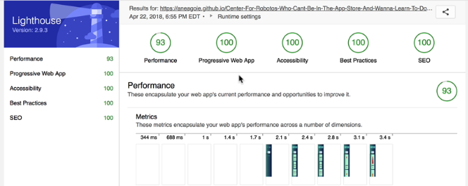

05: class done and practical not done

## 06: Testing

> Bugs cost a lot of money to the Companies

```
$ npm run test
```

```
$ npm test -- --coverage
```

### Types of tests -
1. Unit Tests (function wise testing - less expensive)
2. Integration Tests (function connection with other function - moderate expensive)
3. Automation Tests (UI test - more expensive)


> https://jestjs.io/ is created by Facebook. And react is created by Facebook

### 1. Unit Tests: covers all small pure function of an application.

### 2. Integration Tests: cross communication between different units of code(use Spy to get expected side effect or use Stub to Mock and modify parts of the process that are not inside of the specific test such as mocking a database call. They are expensive and slower and much much harder to write.

### 3. Automation Tests: it always runs in browser or browser like environment because they need to simulate user behavior such as clicking, typing, scrolling etc. This tests are hardest to setup. https://devexpress.github.io/testcafe/ (best for beginner), https://webdriver.io/ (best documentation), http://www.nightmarejs.org/ (simple way simulate user) 

2 different testing is important
1. Unit test
2. Integration test

And completely separate one -
1. Automation test or UI test

Do not send files in production:
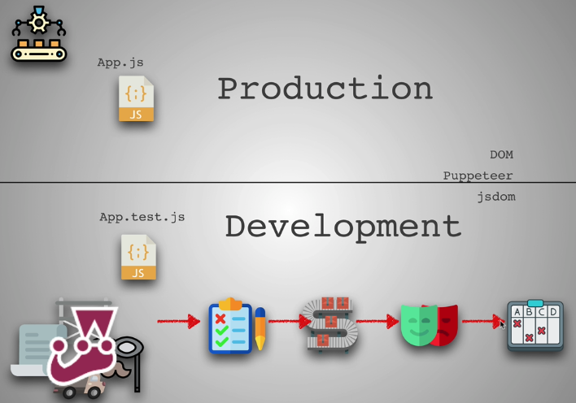

> Jest Cheat Sheet https://github.com/sapegin/jest-cheat-sheet

```
$ mkdir test
$ cd test
$ npm init -y
$ touch script.js
$ npm install --save-dev jest
$ 
```

in package.json
```
"scripts": {
  "test": "jest --watch *.js"
},
```

https://github.com/aneagoie/udemy-testing-exercise

update script.js
```
$ node script.js
$ npm run test
$
$ touch script.test.js
```

update script.test.js
```
$ npm run test
```

### api call test
api demo: https://swapi.co/

create and update script2.js

create and update script2.test.js
```
$ npm install --save node-fetch
$ npm run test
```

### Enzyme: Enzyme is a JavaScript Testing utility for React that makes it easier to test your React Components' output. 
To learn more about the 3 techniques used in Enzyme for testing: **shallow**, **mount**, **render**, have a look at their api documentation (https://airbnb.io/enzyme/docs/api/) to see what kind of methods you can use to test your components. We will be using some of them in the later parts of this section.

> **shallow** is mostly used. Test one thing at a time without effecting child components.

```
$ npm i --save-dev enzyme enzyme-adapter-react-16
```

> **jest** is installed by default in react app (which are created by ```create-react-app```, in ```react-scripts:...`` of package.json)

create and update /src/setupTests.js

create and update /src/components/Card.test.js for **snapshot test**

Run -
```
$ npm test
```

### Coverage
```
$ npm test -- --coverage
```

create and update CardList.test.js 

Create and update CounterButton.test.js

> React project testing: **Jest** + **React** + **Snapshot testing** + **Enzyme**


Create and update App.test.js

Create and update /src/components/MainPage.js

Create and update /src/actions.test.js

```
$ npm run build
$ npm run test -- --coverage
$ npm install --save redux-mock-store
$ 
```

https://www.npmjs.com/package/redux-mock-store

> In testing, we can do infinite things, in limited time

> **A/B testing**: A/B testing (bucket tests or split-run testing) is a randomized experiment with two variants, A and B. Ex- Take your proposed campaign email and create a second version which differs in some way from the original, perhaps it features a different subject line.

> **A/B/C testing (code coverage or test coverage)**: A/B/C testing is just an extended version of A/B testing. Instead of two versions of your email, you have 3, 4, or 5 versions to let you test more variations of the particular element you’re investigating.
The downside? You need more test groups. If you have a small list, it can be a challenge to gather enough email addresses in your test groups to ensure the differences you see are not simply down to chance.

> It is not a good idea of have **100% code coverage** because you are running test, which are most likely don't need to be run and you are wasting your time. You could spend time in other areas of the app.


https://github.com/aneagoie/robofriends-testing

https://blog.usejournal.com/lean-testing-or-why-unit-tests-are-worse-than-you-think-b6500139a009

Great for Asynchronous test: https://www.npmjs.com/package/nock

Lower-level API testing: https://www.npmjs.com/package/supertest

06: class done and practical not done

## 07: TypeScript

Type of languages -
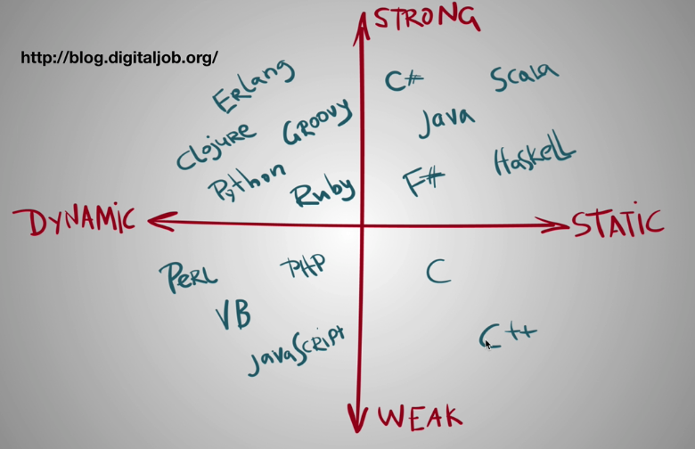

```
# javascript dynamic typed language
var a = 100;

# C/C++, Java static typed language
int a = 100;
a = 100;

# javascript weakly typed language
var a = "boooooyaa";
a + 17

# python strongly typed language
a = "boooooyaa";
a + 17 # ERROR - string adds with decimal
```

Static typed languages:
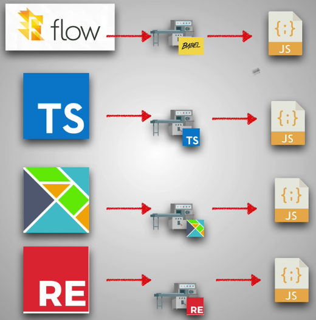

> flow: https://flow.org/ , 
reasonml: https://reasonml.github.io/ , 
typescript: https://www.typescriptlang.org/,
elm: https://elm-lang.org/

> Developer Survey Results 2019: https://insights.stackoverflow.com/survey/2019

### TypeScript installation

Use NVM to install node - 
```
$ node -v
v8.11.3
$ npm -v
5.6.0
$ sudo npm install -g typescript
$ tsc 
$
```

https://www.npmjs.com/package/typescript , https://stackoverflow.com/questions/39404922/tsc-command-not-found-in-compiling-typescript

> TypeScript Editor Support: https://github.com/Microsoft/TypeScript/wiki/TypeScript-Editor-Support

> To learn more about the difference between type  and interface :
https://medium.com/@martin_hotell/interface-vs-type-alias-in-typescript-2-7-2a8f1777af4c
https://www.briangonzalez.org/post/interface-types-vs-type-aliases-typescript

> Type Assertion is another complex topic. If you want to learn more about it, I recommend you read this: https://basarat.gitbooks.io/typescript/docs/types/type-assertion.html

```
$ mkdir type
$ cd type
$ touch typescript.ts
$ tsc typescript.js
$ 
```

In typescript.ts
```
const sum = (a:number, b:number) => {
  return a + b;
}
```

To enable watch mode - https://www.typescriptlang.org/docs/handbook/tsconfig-json.html
```
$
$ tsc --init
$ tsc typescript.ts --watch 
```

Adding TypeScript to react: https://facebook.github.io/create-react-app/docs/adding-typescript

https://github.com/aneagoie/robofriends-typescript


07: class done and practical not done

## 08: SPA vs Server Side Rendering

The first website: http://info.cern.ch/

Product hunt: https://www.producthunt.com

> Too much of everything is not good

### Client Side Rendering (CSR)
| Pros             |Cons                  |
|------------------|---------------------:|
| Rich Interaction |Low SEO potential     |
| Faster Response  |                      |
| Web Applications |Longer initial loads  |

### Server Side Rendering (SSR)
| Pros             |Cons                  |
|------------------|---------------------:|
| Static Site      |Full page reload      |
| SEO              |Slower page rendering |
| Initial Page Load|# Request to server   |


> Server Server Rendering for react static site (text based web sites like documentation) : https://www.gatsbyjs.org/ . React uses (https://reactjs.org/docs/introducing-jsx.html) in their documentation site.

> Server/Client Side Rendering is great with https://nextjs.org/ for rich application (React in client site and next in server side). 

### Setting up Next.js
```
$ mkdir next-ssr
$ cd next-ssr
$ npm init -y
$ 
$ npm install next react react-dom
$ 
$ mkdir pages
```

In package.json
```
"scripts": {
  "start": "next",
}
```

```
$ npm start 
```

go to localhost:3000

create and update /pages/index.js

create and update /pages/about.js

go to localhost:3000/about

> use react html tag components for client site rendering like - ```<Link>``` react tag.

> To better understand the difference between Server Side and Client Side routing, https://medium.com/@wilbo/server-side-vs-client-side-routing-71d710e9227f

> Once you are done, try recreating the effect I demonstrated in the last video: Create two pages in your next.js project, and try linking between them first with the ```<a>``` tag, then with with ```<Link>``` component provided by next. Open up the **Network Tab** in your **chrome developer tools** and see how they are different. 

https://github.com/aneagoie/next-ssr

create and update /components/image.js

```
$ npm install isomorphic-unfetch
```

https://jsonplaceholder.typicode.com/

create and update /pages/robots.js

Global Serverless Deployments: https://zeit.co/now

Pages for search engine crawlers: https://prerender.io/

> https://www.priceline.com/, https://www.walmart.com/, https://www.airbnb.com/ etc. are big fan of SSR because **they care about their SEO**. Lot of their customer come through SEO.

> **SSR is good for SEO**

> **CSR is bad for SEO**

08: class done and practical not done

## 09: Security

> Security is an always evolving field. You will never be 100% secure. No program ever is! However, we can build great resistance by following some guidelines.

> Star of Security


**Injections**: 
1. Sanitize input
2. Parametrize Queries or Prepared Statement
3. Knex.js or other ORMS

```
# ' or 1=1--
INSERT INTO sqlinjection (email) VALUES (; DROP TABLE sqlinjection; --);
```

PostgreSQL GUI tool for macOS: http://www.psequel.com/

To try your own SQL Injection, here is a great exercise you can do to see its power: https://www.hacksplaining.com/exercises/sql-injection

> Front End Code: https://github.com/aneagoie/security-client-exercise

> Back End Code: https://github.com/aneagoie/security-server-exercise

https://medium.com/npm-inc/announcing-npm-6-5d0b1799a905

https://blog.npmjs.org/post/175511531085/the-node-security-platform-service-is-shutting

**3rd Party Libraries**
```
$ npm install -g nsp
$ nsp check # audit package.json
$
$ npm install -g snyk
$ snyk test # audit node_modules directory
$
```

09: 8