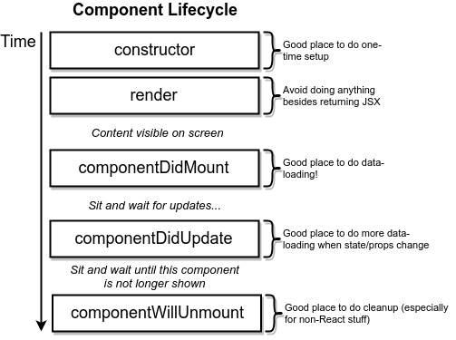
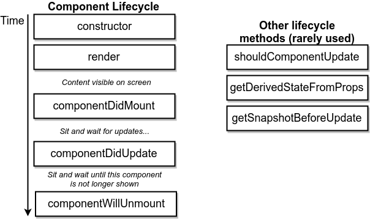
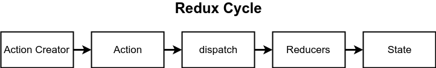
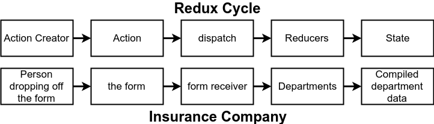
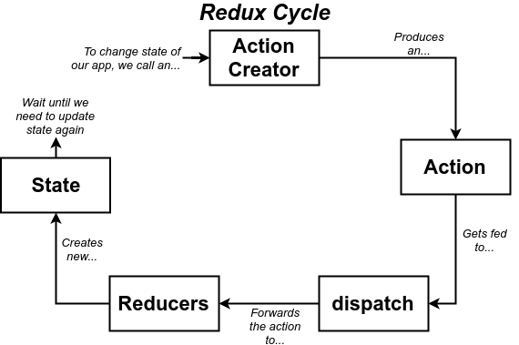

# React Redux

## React Lifecycle Methods

### Life cycle methods :


### Rarely used lifecycle methods:
In some rare case if normal life cycle methods can not help -


## Redux Cycle

### redux cycle:


### redux cycle in insurance  company (example):


### redux cycle circle:


```
$ create-react-app songs
$ cd songs
$ yarn start
$ yarn add redux react-redux
$ 
```

## Projects:
* [jsx](https://github.com/shahjalalh/reactjs/tree/master/react-redux/jsx)
* [components](https://github.com/shahjalalh/reactjs/tree/master/react-redux/components)
* [seasons](https://github.com/shahjalalh/reactjs/tree/master/react-redux/seasons)
* [pics](https://github.com/shahjalalh/reactjs/tree/master/react-redux/pics)
* 11 - pending
* [songs](https://github.com/shahjalalh/reactjs/tree/master/react-redux/songs)
* [blog](https://github.com/shahjalalh/reactjs/tree/master/react-redux/blog)
